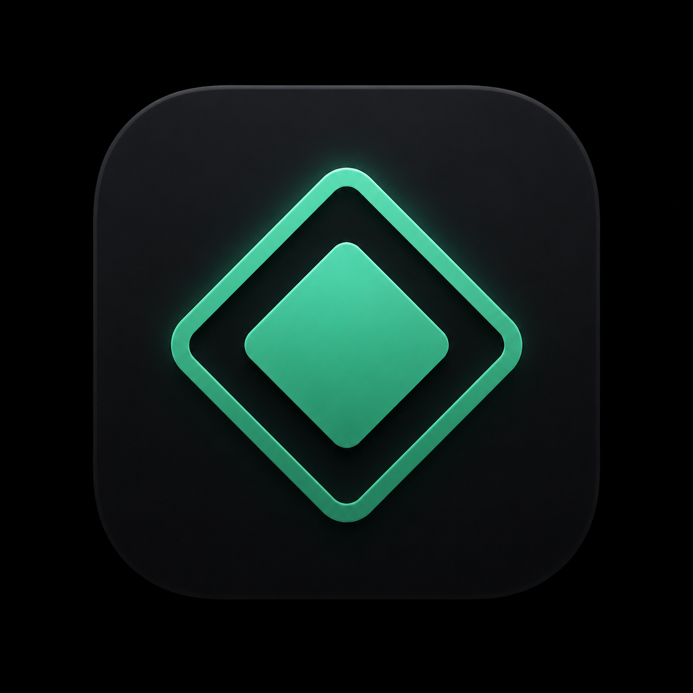

<div align="center">

</div>

<div align="center">

# [Sullybase Local LLM Chat](https://sullydux.github.io/Sullybase-Local-LLM-Chat/)

v2.5.1
</div>

A lightweight desktop app for chatting with local LLMs via **Ollama** or **MLX LM Server**. All conversations stay on your device — no external data transmission.
Built with AI assistance.

---

## Architecture

The app is built on a **Flask + pywebview** stack with provider-specific backends:

- `server.py` — Flask backend router: selects the active provider, persists chats/settings, loads context files, and serves the file browser
- `ollama_server.py` — Ollama adapter: wraps Ollama's HTTP API
- `mlx_server.py` — MLX adapter: wraps MLX LM Server's OpenAI-compatible API
- `app.py` — Desktop launcher: starts Flask in a daemon thread, waits for it to be ready, then opens a pywebview window
- `index.html` / `app.js` / `style.css` — Frontend served by Flask as static files

Chats and settings are stored as JSON files in the app support directory:
- **macOS**: `~/Library/Application Support/Sullybase-LLM-Chat/`

---

## Features

### Sidebar
- **Model selector** with refresh button — lists all locally available models for the active backend
- **Chat history** — browse, search (with snippet preview), and switch between past conversations
- **Stats panel** — live device badge, memory usage bar, context window usage bar, tokens/sec

### Chat Interface
- **Streaming responses** with blinking cursor and stop button
- **Markdown rendering** — headings, code blocks with syntax highlighting and copy button, tables, blockquotes, lists
- **Thinking block support** — collapsible `<think>...</think>` sections for reasoning models
- **AI-generated chat titles** with word-sliced fallback; retries on subsequent messages if the first attempt fails
- **Context files** — attach local files or folders (up to 2 MB per file) to inject into the system prompt; re-read from disk on each message
- **Regenerate & edit** — re-roll the last reply, or edit a prior user message to resend from that point (the following replies are discarded and regenerated)
- **Draft persistence** — unsent text is kept per-chat across switches and reloads
- **Keyboard shortcuts** — `Cmd/Ctrl+N` new chat, `Cmd/Ctrl+K` search, `Esc` closes panels
- **Scroll-to-bottom button** — appears when you've scrolled up in a long chat
- **Message timestamps** — each assistant reply shows when it was sent (time same-day, date otherwise)

### Performance info bar
Shows prompt tokens ↑, completion tokens ↓, tokens/sec, first-token latency, and total generation time after each response.

---

## Requirements

- **Python 3.14+**
- Dependencies: see `requirements.txt` (`flask`, `pywebview`, `requests`)
- **[Ollama](https://ollama.com)** installed and running for the Ollama backend.
- **MLX LM Server** installed and running for the MLX backend on Apple Silicon.

Install and start either backend:

```bash
# Ollama
curl -fsSL https://ollama.com/install.sh | sh
open /Applications/Ollama.app
# or: ollama serve

# MLX LM Server
pip install mlx-lm
python -m mlx_lm.server --model <model>
```

Replace `<model>` with your chosen MLX model id, for example `mlx-community/Llama-3.2-3B-Instruct-4bit`.

---

## Setup

1. **Download** the [Code](https://github.com/sullydux/Sullybase-Local-LLM-Chat/releases/latest) folder from this repository
2. **Install dependencies**:
   ```bash
   pip install -r requirements.txt
   ```
3. **Run**:
   ```bash
   python app.py
   ```
4. **Connect your backend** — open Ollama or start MLX, then click **↻** in the sidebar to load models

### Optional: macOS Automator Shortcut

You can create a double-clickable launcher using Automator:

1. Open **Automator** → New Document → **Application**
2. Add a **Run Shell Script** action
3. Set the script to:
   ```bash
   cd /path/to/repo
   python app.py
   ```
4. Save the Automator app anywhere (e.g. Applications or your Desktop)

---

## Notes

- **Privacy**: All data stays local — no external network calls except to your local Ollama or MLX server
- **Logging**: Rotating logs written to the app support directory (`logs/sullybase.log`)
- **Thinking models**: Thinking is parsed and shown as collapsible sections
- **macOS file browser**: Uses a best-effort native `tkinter` file dialog from the Flask backend and falls back cleanly if the dialog cannot open

---

## Model Support

Developed and tested on an Apple M2 Air (8 GB RAM) with `qwen2.5-coder:3b` and `qwen3.5:4b-mlx`. Any compatible Ollama or MLX model should work given sufficient RAM and compute.

---

## Contributing

1. Open an issue to discuss the change first
2. Fork, implement, and submit a pull request

Use **GitHub Issues** for bug reports and feature requests.

---

## Possible Updates

- Agentic mode
